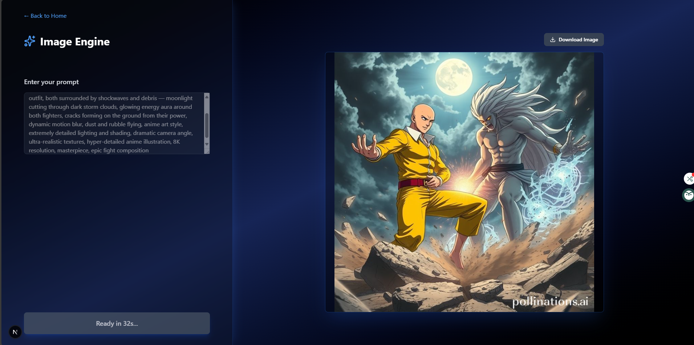

# OnePnG.AI - AI Image Generator

A futuristic, high-end frontend platform for generating AI art, built with Next.js, Tailwind CSS, and advanced animations with Framer Motion.


---

### ▶️ [Live Demo](https://image-gernerator-app.vercel.app)  

---

## 📖 About The Project

OnePnG.AI is a visually-rich, futuristic AI image generator platform. It provides a high-end, seamless experience for users who want to generate creative AI artwork instantly. The platform leverages a serverless Next.js API route to proxy requests to the **pollinations.ai** API, allowing 100% free and registration-free usage.  

The system is designed with a stunning, animated landing page to attract users, and a fully functional generator page to "Create Beyond Reality." Its focus is on smooth scroll-based animations, sleek dark-themed design, and an immersive user experience.

  

---

## 🌟 Key Features

- **Futuristic SaaS Landing Page**: Animated floating elements, professional footer, and a deep immersive experience.  
- **Advanced Scroll-Based Gallery**: Sticky-scroll animation presenting images dynamically in an 11-image cross-fade collage.  
- **Dynamic Generator UI**: Dark-themed generator page with prompt input, rate-limit countdown, and image display area.  
- **Serverless API Route**: Next.js API route securely proxies requests to Pollinations.ai without exposing the API.  
- **100% Free Generation**: No API key or billing required.  
- **Fully Responsive Design**: Pixel-perfect on all devices using Tailwind CSS.  

---

## 🔧 Tech Stack

| Technology | Role & Justification |
| :--- | :--- |
| **Next.js** | **Full-Stack Framework**: High performance, file-based routing, serverless API routes. |
| **React** | **UI Library**: Component-based architecture, state management with hooks. |
| **Framer Motion**| **Animation Library**: Used for hero animations, floating images, and scroll-driven gallery effects. |
| **Tailwind CSS**| **CSS Framework**: Utility-first styling for sleek dark-themed responsive UI. |
| **Lucide React**| **Icons**: Modern, clean icons for UI and footer. |
| **Vercel** | **Hosting Platform**: Easy deployment with CI/CD, scalability, and free tier. |

---

## 📦 Getting Started

To run a local copy of the project:

### Prerequisites

- Node.js v18 or higher  
- npm  

### Installation & Setup

1.  **Clone the repository**
    ```bash
    git clone [https://github.com/your-username/onepng-ai.git](https://github.com/your-username/onepng-ai.git)
    cd onepng-ai
    ```
2.  **Install dependencies**
    ```bash
    npm install
    ```

### ▶️ Running the App
```bash
npm run dev


The application will be available at http://localhost:3000.
